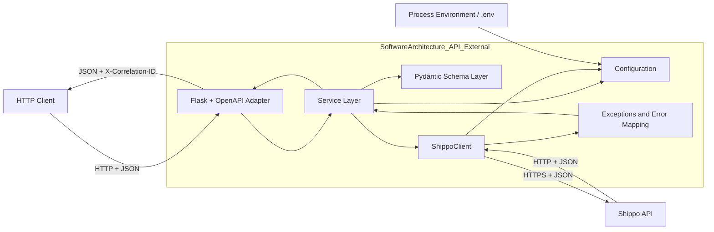
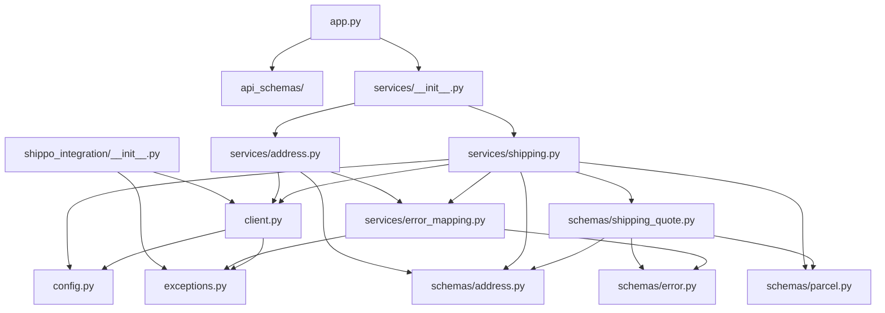
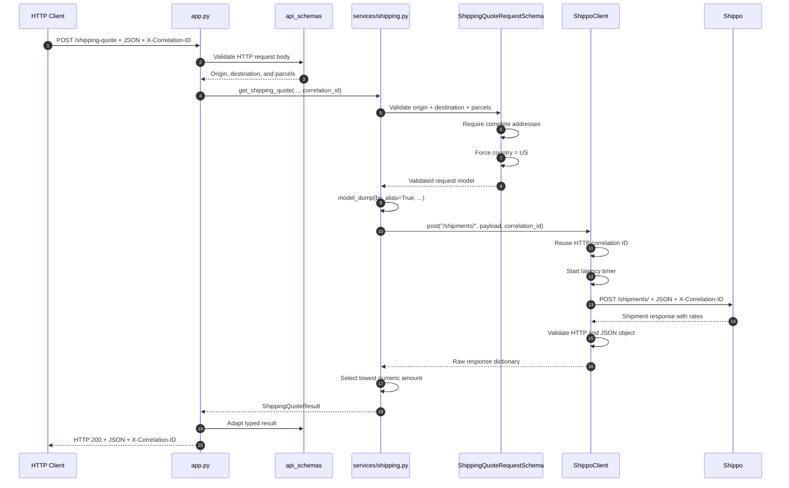
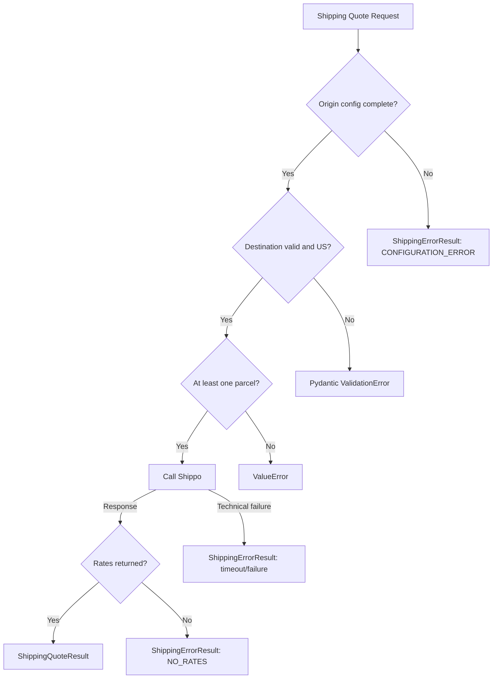
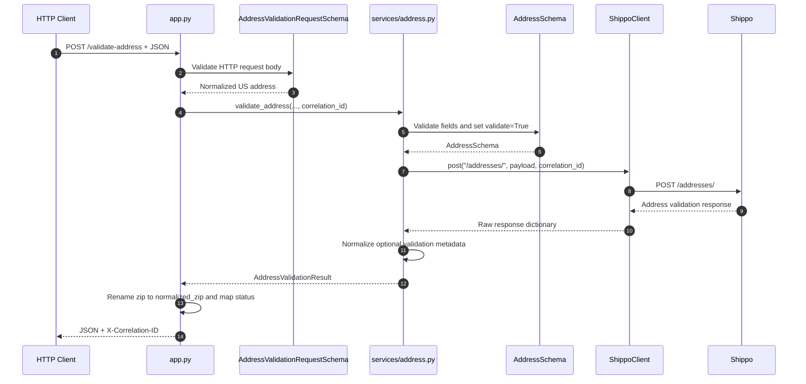
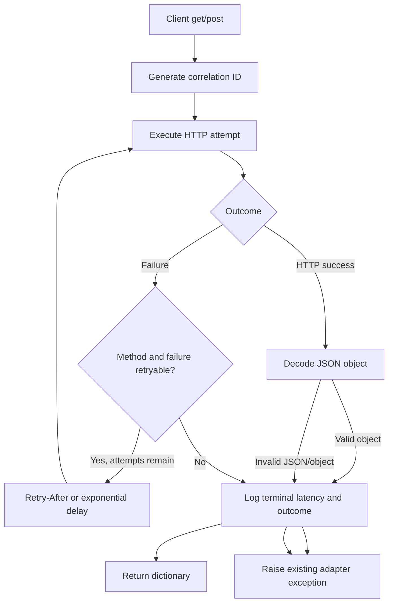

# Shippo External Integration Architecture

## 1. Purpose

`SoftwareArchitecture_API_External` is an independent, locally runnable HTTP
integration service for Shippo. A thin Flask + flask-openapi3 adapter invokes
the existing Python service layer. It is not installed by the main DFSB backend;
the backend uses the integration service through HTTP + JSON only.

The repository is responsible for:

- Exposing local JSON/OpenAPI endpoints on port 8001.
- Loading and validating Shippo configuration.
- Validating addresses, parcels, and quote requests.
- Sending authenticated requests to Shippo.
- Applying conservative retry and rate-limit behavior.
- Converting Shippo responses and failures into typed application results.

It is not responsible for:

- Frontend behavior or the main DFSB backend's Flask routes.
- Customer or generator database access.
- Product-specific shipping decisions in `Sprint_DFSB_Back_End_API`.
- International shipping. Shipment requests are restricted to the US.

## 2. Macro View



The normal direction of dependencies is from high-level business operations to
lower-level transport and configuration. The HTTP client does not know about
address validation or shipping-rate selection.

## 3. Layered Architecture

```text
HTTP Client
  |
  v
app.py                    HTTP validation, correlation, status mapping
  |
  v
api_schemas/              HTTP-only request/response contracts
  |
  v
services/                 Business operations and response interpretation
  |
  +--> schemas/           Input validation and typed result contracts
  +--> config.py          Required environment-owned values
  +--> client.py          HTTP transport, retries, tracing, and JSON decoding
           |
           +--> exceptions.py
           |
           v
        Shippo API
```

### 3.1 HTTP Adapter Layer

File: `app.py`

Responsibilities:

- Expose `/`, `/health`, `/validate-address`, and `/shipping-quote`.
- Validate JSON through API-specific Pydantic models.
- Create or reuse one HTTP correlation ID.
- Pass the ID explicitly through services to Shippo.
- Map stable business error codes to HTTP statuses.
- Serialize internal typed results into JSON-safe dictionaries.

The routes do not build Shippo payloads, implement retries, load backend data,
or select rates.

Directory: `api_schemas/`

These models describe only the public HTTP contract. Internal provider models
remain under `shippo_integration/schemas/`.

### 3.2 Configuration Layer

File: `shippo_integration/config.py`

Responsibilities:

- Load the repository-level `.env` without replacing existing process values.
- Validate Shippo credentials and transport settings.
- Return immutable `ShippoSettings` and HTTP server settings.

Configuration precedence is:

1. Process environment variables.
2. Values from `.env`.
3. Safe transport defaults where documented.

Shipping addresses are request data. Configuration errors represent actual
integration settings such as a missing or invalid Shippo credential.

### 3.3 Internal Schema Layer

Directory: `shippo_integration/schemas/`

| Module | Responsibility |
|---|---|
| `address.py` | Generic Shippo address input and typed address-validation result |
| `parcel.py` | Parcel measurements and unit fields |
| `shipping_quote.py` | Complete US shipment validation and typed quote results |
| `error.py` | Stable machine-readable business error codes |

`AddressSchema` is intentionally flexible because Shippo can return or accept
partial/extended address objects. `ShippingQuoteRequestSchema` is stricter: it
requires complete origin and destination fields before a rate request.

### 3.4 Service Layer

Directory: `shippo_integration/services/`

| Module | Public operation | Responsibility |
|---|---|---|
| `address.py` | `validate_address(...)` | Build an address payload and interpret validation results |
| `shipping.py` | `get_shipping_quote(address_to, parcels)` | Load origin, validate shipment, request rates, and select the cheapest rate |
| `error_mapping.py` | Internal helper | Convert adapter exceptions to stable business codes/messages |

Services return typed Pydantic models:

- `AddressValidationResult`
- `ShippingQuoteResult`
- `ShippingErrorResult`

### 3.5 HTTP Client Layer

File: `shippo_integration/client.py`

`ShippoClient` owns all HTTP behavior:

- Authentication headers.
- URL normalization.
- Correlation IDs.
- Request latency logging.
- Method-aware retry behavior.
- `Retry-After` parsing.
- HTTP and JSON response validation.
- Translation to adapter exceptions.

Its public interface remains small:

```python
client.get(endpoint)
client.post(endpoint, payload)
```

Both methods return decoded Shippo JSON objects as dictionaries.

### 3.6 Exception and Business Error Layers

File: `shippo_integration/exceptions.py`

Adapter exceptions describe technical failures:

- `ShippoConfigurationError`
- `ShippoTimeoutError`
- `ShippoAPIError`
- `ShippoResponseError`

File: `shippo_integration/services/error_mapping.py`

Services convert those exceptions into stable business codes:

| Technical condition | Business code |
|---|---|
| Missing/invalid configuration | `CONFIGURATION_ERROR` |
| Request timeout | `SHIPPO_TIMEOUT` |
| Network, HTTP, or malformed provider response | `SHIPPO_FAILURE` |
| Shippo returns no rates | `NO_RATES` |
| Shippo rejects an address | `INVALID_ADDRESS` |

## 4. Module Dependency View



## 5. End-to-End Shipping Quote Example

### 5.1 HTTP Caller Input

The caller supplies the changing destination and parcel data. The origin is not
accepted from the caller; it comes from required environment configuration.

```http
POST /shipping-quote HTTP/1.1
Host: 127.0.0.1:8001
Content-Type: application/json
X-Correlation-ID: order-123

{
  "address_to": {
        "name": "Customer Company",
        "street1": "123 Main Street",
        "city": "Atlanta",
        "state": "GA",
    "zip": "30301"
  },
  "parcels": [
    {
            "length": "24",
            "width": "16",
            "height": "12",
            "distance_unit": "in",
            "weight": "12",
      "mass_unit": "lb"
    }
  ]
}
```

Country may be omitted. The shipping schema inserts `country: "US"` for both
origin and destination. An explicitly non-US country is rejected before Shippo
is called.

### 5.2 Address Ownership

Each HTTP request supplies complete origin and destination addresses. The
backend supplies parcel measurements loaded from its database. No operational
address is stored in integration-service configuration.

### 5.3 Request Sequence



### 5.4 Exact Shippo Payload Shape

The service sends this structure to `/shipments/`:

```json
{
  "address_from": {
    "name": "Origin Company",
    "street1": "123 Origin Street",
    "city": "Torrance",
    "state": "CA",
    "zip": "90001",
    "country": "US"
  },
  "address_to": {
    "name": "Customer Company",
    "street1": "123 Main Street",
    "city": "Atlanta",
    "state": "GA",
    "zip": "30301",
    "country": "US"
  },
  "parcels": [
    {
      "length": "24",
      "width": "16",
      "height": "12",
      "distance_unit": "in",
      "weight": "12",
      "mass_unit": "lb"
    }
  ]
}
```

### 5.5 Successful Typed Result

```python
if result.success:
    print(result.carrier)
    print(result.amount)
```

The result type is `ShippingQuoteResult`:

```json
{
  "success": true,
  "carrier": "USPS",
  "service": "Priority",
  "amount": "12.00",
  "currency": "USD",
  "estimated_days": 3
}
```

Serialize at an API boundary with:

```python
response_body = result.model_dump(exclude_unset=True)
response_json = result.model_dump_json(exclude_unset=True)
```

### 5.6 Failure Paths



## 6. End-to-End Address Validation Example

```http
POST /validate-address HTTP/1.1
Host: 127.0.0.1:8001
Content-Type: application/json

{
  "customer_name": "Customer Company",
  "street1": "123 Main Street",
  "city": "Atlanta",
  "state": "GA",
  "zip_code": "30301",
  "country": "US"
}
```

Sequence:



Possible outcomes are:

- Valid address: `success=True`, `valid=True`.
- Invalid address: `success=False`, `error_code="INVALID_ADDRESS"`.
- Timeout: `success=False`, `error_code="SHIPPO_TIMEOUT"`.
- Provider/HTTP failure: `success=False`, `error_code="SHIPPO_FAILURE"`.
- Missing client configuration: `success=False`, `error_code="CONFIGURATION_ERROR"`.

## 7. HTTP Retry and Observability Flow

Every `get()` or `post()` call receives a generated UUID sent as
`X-Correlation-ID`. The same identifier is reused for all attempts belonging to
that logical request.



Retry policy:

| Method | Retried conditions |
|---|---|
| GET | Timeout, connection/chunk failure, HTTP 429/502/503/504 |
| POST | HTTP 429 only |

POST does not retry ambiguous network, timeout, gateway, or response-decoding
failures because Shippo may already have created the address or shipment.

Logs include:

- Correlation ID.
- Method and endpoint path.
- Attempt count.
- Retry category and delay.
- Terminal outcome.
- Total latency in milliseconds.

Logs exclude credentials, headers, payloads, response bodies, query strings,
and raw exception text.

## 8. Configuration Summary

| Variable | Required | Purpose |
|---|---:|---|
| `INTEGRATION_API_HOST` | No | HTTP bind host; default 127.0.0.1 |
| `INTEGRATION_API_PORT` | No | HTTP port; default 8001 |
| `INTEGRATION_API_DEBUG` | No | Local Flask debug flag |
| `SHIPPO_API_KEY` | Yes | Shippo authentication |
| `SHIPPO_BASE_URL` | No | Shippo API base URL |
| `SHIPPO_TIMEOUT_SECONDS` | No | Timeout for one HTTP attempt |
| `SHIPPO_MAX_ATTEMPTS` | No | Total attempts for retryable requests |
| `SHIPPO_BACKOFF_SECONDS` | No | Exponential retry base delay |
| `SHIPPO_MAX_RETRY_AFTER_SECONDS` | No | Maximum honored provider delay |

## 9. Testing Architecture

```text
tests/
  test_http_endpoints.py   Flask test-client coverage for integration routes
  unit/
    test_config.py          Credential, transport, and HTTP server configuration
    test_client.py          HTTP, retries, correlation, latency, redaction
    test_schemas.py         Request and typed response contracts
    test_services.py        Service payloads, outcomes, and error mapping
    test_documentation.py   Required module/class/function docstrings
  integration/
    test_shippo_connection.py  Opt-in real Shippo connectivity
```

Unit tests use mocks and do not contact Shippo. The integration test runs only
when `RUN_SHIPPO_INTEGRATION=1` is explicitly set.

## 10. Design Rules for Future Changes

1. Keep HTTP behavior inside `ShippoClient`.
2. Keep HTTP routes thin: validate, call services, map status, serialize.
3. Keep provider-independent decisions inside services.
4. Validate data before calling Shippo.
5. Keep the origin in environment configuration and destination in request data.
6. Preserve the US-only country rule unless international support is designed
   explicitly across schemas, services, tests, and documentation.
7. Return typed service models and serialize only at API boundaries.
8. Branch on stable business error codes, not message text.
9. Never log credentials, payloads, response bodies, or personal address data.
10. Keep POST retries conservative to avoid duplicate provider resources.
11. Add mocked tests for every new HTTP/provider response or failure path.
