# Hydrogen Generator Management System Architecture

## 1. Document Purpose

This document describes how the three independently runnable repositories work
together as one system. It focuses on cross-repository communication,
responsibility boundaries, end-to-end data movement, trust boundaries, and
runtime topology.

Detailed repository views are available in:

- [Frontend architecture](../SoftwareArchitecture_Front_End/SPECIFIC_ARCHITECTURE.md)
- [Backend API architecture](../SoftwareArchitecture_Back_End_API/SPECIFIC_ARCHITECTURE.md)
- [External integration architecture](SPECIFIC_ARCHITECTURE.md)

## 2. System Summary

The application manages customers, hydrogen generator definitions, and the
relationships between them. It also requests shipping estimates using trusted
generator measurements and caller-supplied US addresses.

| Repository | Runtime | Port | Primary ownership |
|---|---|---:|---|
| `SoftwareArchitecture_Front_End` | Static HTML/CSS/JavaScript in a browser | `5500` | User interaction and presentation |
| `SoftwareArchitecture_Back_End_API` | Flask + OpenAPI + SQLAlchemy | `5001` | Domain CRUD, SQLite, trusted product data, freight policy |
| `SoftwareArchitecture_API_External` | Flask + OpenAPI + requests | `8001` | Shippo contracts, credentials, retries, rate selection |

External dependencies:

| Dependency | Accessed by | Purpose |
|---|---|---|
| SQLite `database/db.sqlite3` | Backend only | Persist customers, generators, and relationships |
| Shippo HTTPS API | Integration API only | Validate addresses and obtain carrier rates |

## 3. System Context

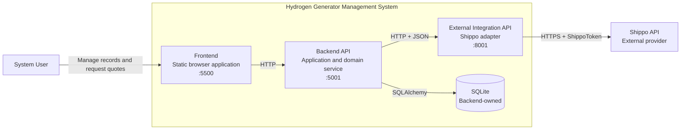

There are two strict communication rules:

1. The frontend calls only the backend.
2. Only the integration API calls Shippo.

No repository imports another repository's source. Integration occurs through
versionable HTTP and JSON contracts.

## 4. Container and Deployment View

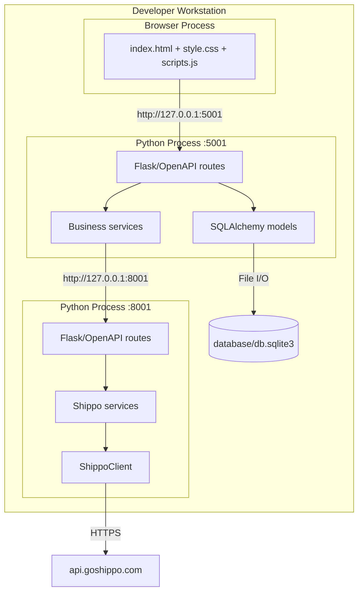

The three runtimes can fail independently. If Shippo or the integration API is
unavailable, backend CRUD remains usable. If the backend is unavailable, the
static frontend can render but cannot load or mutate data.

## 5. Responsibility and Data Ownership

| Concern | Frontend | Backend | Integration API |
|---|:---:|:---:|:---:|
| Forms, tabs, tables, user feedback | Owns |  |  |
| Client-side convenience validation | Owns |  |  |
| Authoritative application validation |  | Owns |  |
| Customers, generators, relationships |  | Owns |  |
| SQLite schema and transactions |  | Owns |  |
| Trusted generator dimensions/weight | Displays | Owns | Consumes |
| Standard parcel/freight policy | Previews | Owns |  |
| Origin/destination addresses | Collects | Transforms | Validates/forwards |
| Address persistence | None | None | None |
| Shippo API key | Never | Never | Owns |
| Provider authentication and paths |  |  | Owns |
| Retry and `Retry-After` policy |  |  | Owns |
| Cheapest rate selection |  |  | Owns |
| Correlation ID | Receives response | Creates/forwards | Forwards/reuses |

Addresses are transient request data. The system does not store shipping
addresses in SQLite or environment configuration.

## 6. Cross-Repository Dependency Direction

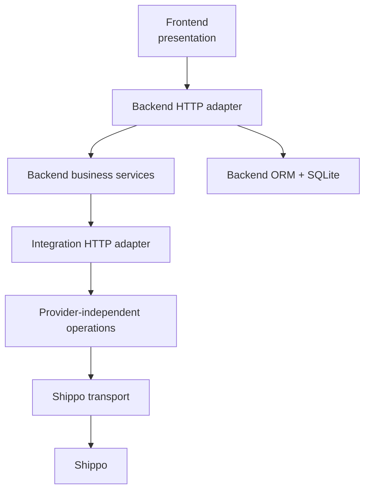

Responses travel upward through the same boundaries, but source-code
dependencies remain directed downward. The browser never needs provider schema
knowledge, and the integration API never needs backend ORM knowledge.

## 7. Domain Model

The persistent model belongs entirely to the backend.

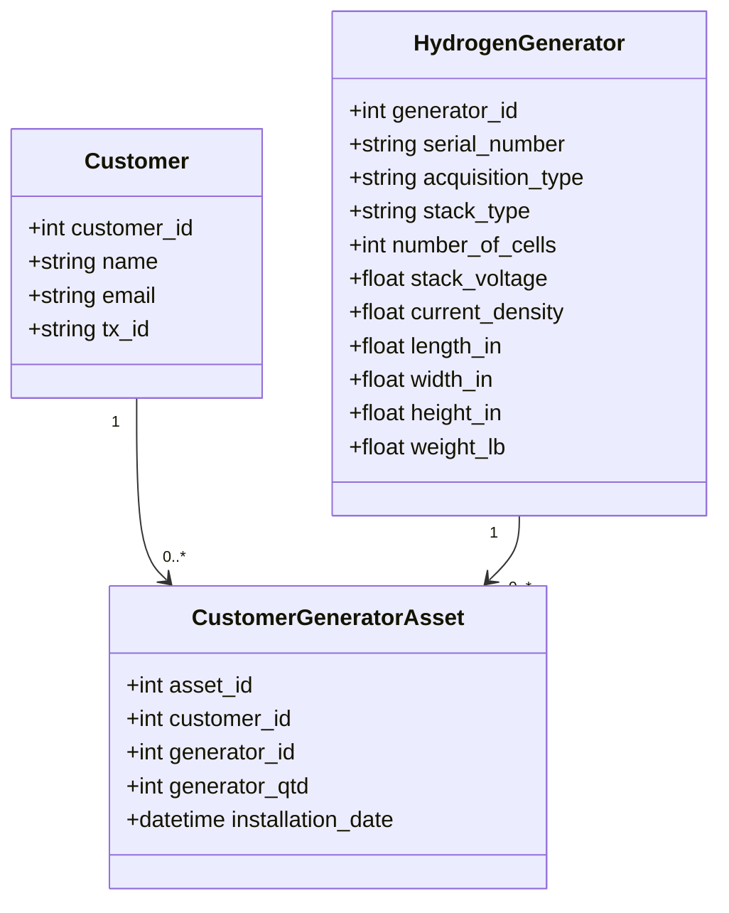

The relationship is not merely a join table: quantity and installation date
are first-class relationship attributes.

## 8. Communication Contracts

### Frontend to backend

| Operation family | Encoding | Examples |
|---|---|---|
| CRUD reads/deletes | Query parameters + JSON responses | `/customer?customer_id=42` |
| CRUD creates/updates | FormData | `POST /hydrogen-generator` |
| Shipping quote | JSON | `POST /shipping-quote` |

### Backend to integration API

| Route | Encoding | Contract |
|---|---|---|
| `POST /validate-address` | JSON | One complete US address |
| `POST /shipping-quote` | JSON | Complete origin/destination plus one or more parcels |

### Integration API to Shippo

| Provider operation | Purpose |
|---|---|
| `POST /addresses/` | Validate and normalize one address |
| `POST /shipments/` | Create shipment and obtain rates |

Every API boundary validates the data it receives. A successful HTTP transport
does not automatically imply a successful business outcome; callers inspect
`success`, `valid`, and `error_code` where applicable.

## 9. CRUD End-to-End Flow

CRUD does not involve the integration API.

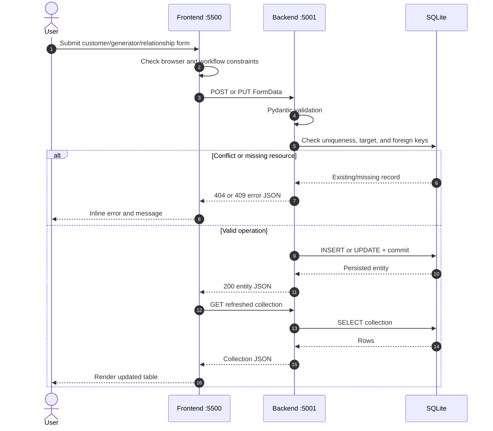

Example customer create body:

```text
name=Acme Corporation
email=contact@example.com
tx_id=123-45-6789
```

Example response:

```json
{
  "customer_id": 42,
  "name": "Acme Corporation",
  "email": "contact@example.com",
  "tx_id": "123-45-6789"
}
```

## 10. Address Validation Flow

Address validation is exposed by both APIs but is currently an API-oriented
operation rather than a dedicated frontend panel.

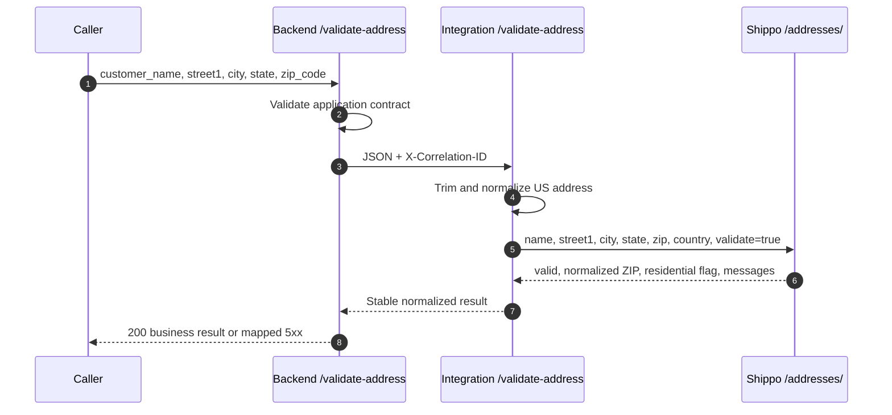

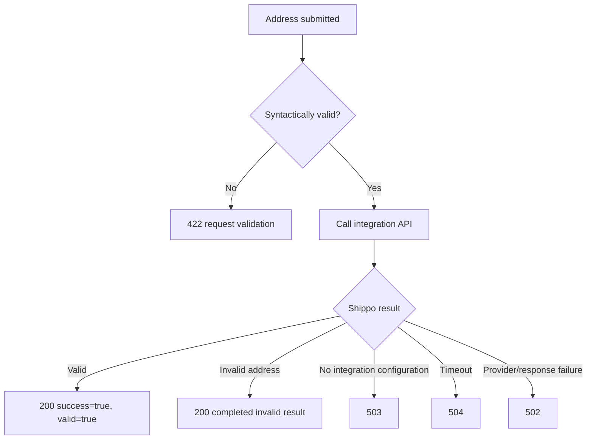

Example integration request:

```json
{
  "customer_name": "Acme Corporation",
  "street1": "123 Main Street",
  "city": "Atlanta",
  "state": "GA",
  "zip_code": "30301",
  "country": "US"
}
```

Example normalized result:

```json
{
  "success": true,
  "valid": true,
  "normalized_zip": "30301-1234",
  "is_residential": false,
  "messages": []
}
```

## 11. Shipping Quote Flow

Shipping crosses every runtime and illustrates the ownership boundaries most
clearly.

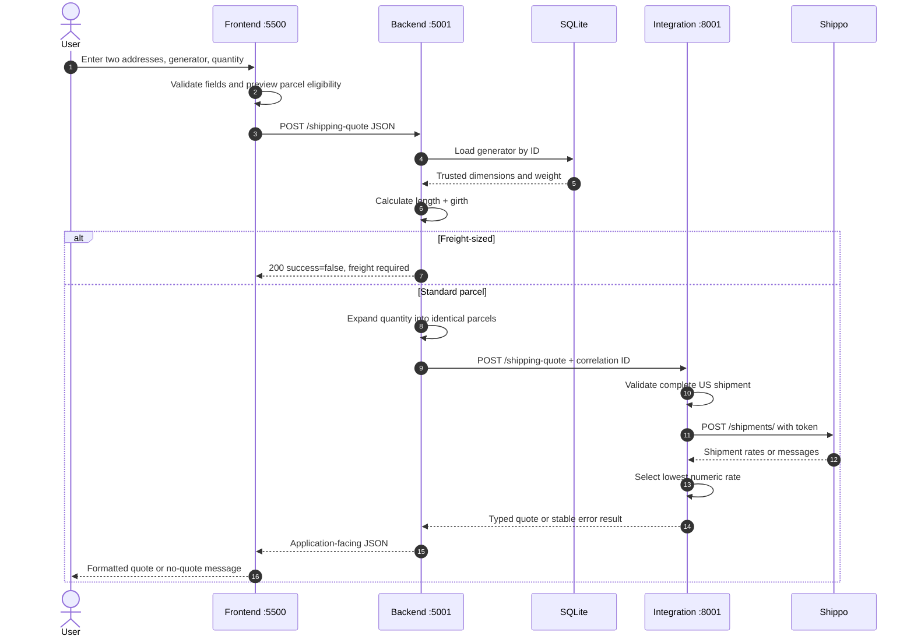

### Step 1: frontend request

```json
{
  "origin_name": "West Coast Warehouse",
  "origin_street": "100 Manufacturing Way",
  "origin_city": "Torrance",
  "origin_state": "CA",
  "origin_zip": "90501",
  "customer_name": "Acme Corporation",
  "destination_street": "123 Main Street",
  "destination_city": "Atlanta",
  "destination_state": "GA",
  "destination_zip": "30301",
  "generator_id": 7,
  "generator_quantity": 2
}
```

### Step 2: backend enrichment

The backend loads generator `7` and creates two parcel objects from its stored
measurements. Browser-supplied measurements are neither requested nor trusted.

```json
{
  "address_from": {
    "name": "West Coast Warehouse",
    "street1": "100 Manufacturing Way",
    "city": "Torrance",
    "state": "CA",
    "zip": "90501",
    "country": "US"
  },
  "address_to": {
    "name": "Acme Corporation",
    "street1": "123 Main Street",
    "city": "Atlanta",
    "state": "GA",
    "zip": "30301",
    "country": "US"
  },
  "parcels": [
    {
      "length": "24.0",
      "width": "16.0",
      "height": "12.0",
      "distance_unit": "in",
      "weight": "50.0",
      "mass_unit": "lb"
    },
    {
      "length": "24.0",
      "width": "16.0",
      "height": "12.0",
      "distance_unit": "in",
      "weight": "50.0",
      "mass_unit": "lb"
    }
  ]
}
```

### Step 3: integration result

```json
{
  "success": true,
  "carrier": "UPS",
  "service": "Ground",
  "amount": "45.99",
  "currency": "USD",
  "estimated_days": 3
}
```

The backend adds its application-facing message and the frontend formats the
amount using the returned currency.

## 12. Parcel and Freight Decision

The backend owns the authoritative standard-parcel check. The frontend repeats
it only for immediate feedback.

For longest dimension $L$ and the other dimensions $W$ and $H$:

$$
	ext{length plus girth} = L + 2(W + H)
$$

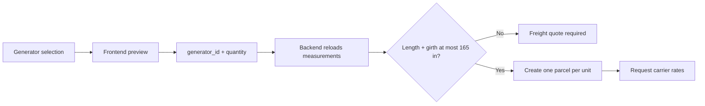

This duplicated calculation is deliberate defense in depth: the frontend gives
fast feedback, but only the backend can make the trusted decision.

## 13. Correlation and Observability

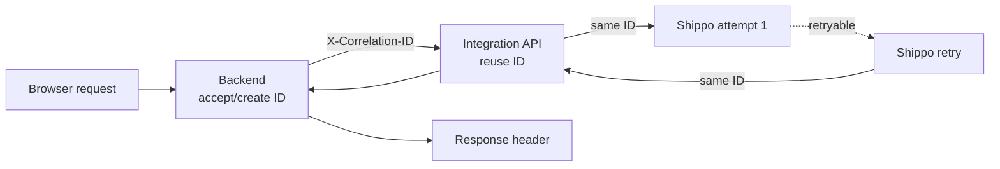

Both APIs log request metadata and latency. The integration client also logs
attempt count and retry category. Logs must exclude credentials, request
bodies, response bodies, full URLs, query strings, and personal address data.

## 14. Trust and Security Boundaries

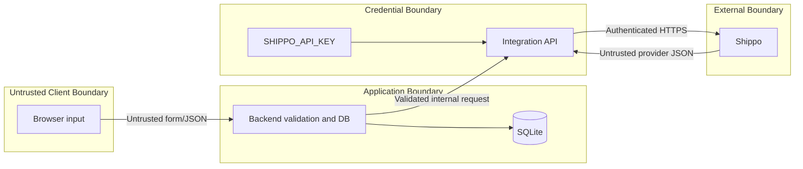

Security properties:

- The Shippo key exists only in the integration process environment or its
  ignored `.env` file.
- The frontend cannot choose parcel dimensions or weight for a quote.
- Provider JSON is validated and normalized before reaching the backend.
- Error bodies do not expose stack traces, credentials, or raw provider data.
- CORS permits browser-to-backend communication; it is not authentication.
- The current system is intended for local development and has no user
  authentication or authorization layer.

## 15. Failure Propagation

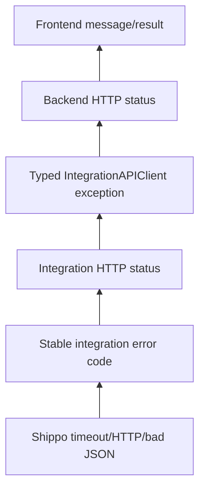

| Outcome | Integration code | Final HTTP semantics |
|---|---|---|
| Address cannot be validated | `INVALID_ADDRESS` | `200`, completed business result |
| No carrier rate available | `NO_RATES` | `200`, completed business result |
| Missing/invalid Shippo settings | `CONFIGURATION_ERROR` | `503` |
| Shippo timeout | `SHIPPO_TIMEOUT` | `504` |
| Shippo HTTP/network/response failure | `SHIPPO_FAILURE` | `502` |
| Unknown local defect | None | `500` at the failing API boundary |

Message text is for display. Application branching should use HTTP status and
stable `error_code` values.

## 16. Availability and Runtime Scenarios

| Scenario | CRUD | Address validation | Shipping quote |
|---|:---:|:---:|:---:|
| All services running | Available | Available | Available |
| Shippo unavailable | Available | Technical failure | Technical failure |
| Integration API stopped | Available | `502`/connection failure | `502`/connection failure |
| Backend stopped | Unavailable | Unavailable through backend | Unavailable |
| Frontend not served | APIs remain available | API remains available | API remains available |

The APIs expose OpenAPI documentation at `/openapi`. The integration `/health`
route reports process liveness only; it does not prove that Shippo credentials
or provider connectivity are valid.

## 17. Local Startup

Start dependencies from deepest to shallowest:

1. Configure and start `SoftwareArchitecture_API_External` on port `8001`.
2. Configure and start `SoftwareArchitecture_Back_End_API` on port `5001`.
3. Serve `SoftwareArchitecture_Front_End` with Live Server on port `5500`.

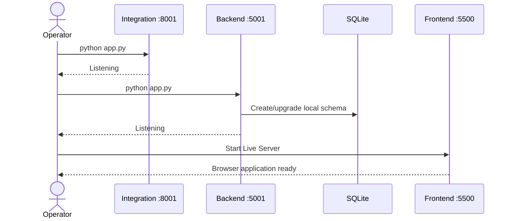

## 18. Testing Strategy

| Repository | Normal test scope | External dependency |
|---|---|---|
| Frontend | Static HTML, accessibility, JavaScript contracts | None |
| Backend | Schemas, ORM behavior, routes, shipping policy, mocked integration client | None |
| Integration API | Schemas, routes, retries, error mapping, mocked Shippo | None |
| Integration opt-in | Real Shippo connectivity | Shippo credentials and network |

The default suites are deterministic and should not consume provider resources.
Only the explicitly enabled integration test contacts Shippo.

## 19. Architectural Principles

1. Communicate across repositories through HTTP contracts, not source imports.
2. Keep persistent domain data and product policy in the backend.
3. Keep provider credentials and transport policy in the integration API.
4. Treat frontend validation as usability support, never authority.
5. Load trusted shipping measurements from SQLite.
6. Treat invalid-address and no-rate outcomes as business data.
7. Use gateway statuses for downstream technical failures.
8. Preserve correlation IDs across service boundaries and retries.
9. Avoid logging secrets, personal addresses, payloads, or response bodies.
10. Update all four architecture documents when a cross-boundary contract
  changes.
