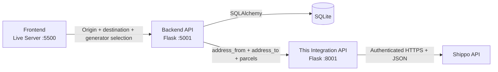

# Shippo External Integration

Locally runnable internal HTTP service for generic Shippo operations. It is
intentionally not an installable distribution and is not imported by
`SoftwareArchitecture_Back_End_API`. The backend communicates with this service only
through its HTTP + JSON contract.

For the cross-repository system view, see
[OVERALL_ARCHITECTURE.md](OVERALL_ARCHITECTURE.md). For this repository's
module relationships, request sequences, payload examples, and retry behavior,
see [SPECIFIC_ARCHITECTURE.md](SPECIFIC_ARCHITECTURE.md).

## Current Architecture



This repository owns complete shipment validation, Shippo authentication,
provider endpoints, transport, retries, rate selection, and provider-message
normalization. It does not import backend models or access SQLite.

## Container Deployment and Isolation

The container runs `app:app` with Gunicorn on port `8001`. Compose does not
publish that port to the host; the backend reaches it privately at
`http://shippo-integration:8001`. This is the only service that receives
`SHIPPO_API_KEY`. Its local `/health` check reports process liveness without
validating credentials or contacting Shippo.

See [the parent containerization guide](../CONTAINERIZATION.md) for the full
topology and operating commands.

## Structure

```text
app.py                      Flask + OpenAPI HTTP adapter
api_schemas/                HTTP-only request/response contracts
shippo_integration/
	config.py                 Environment loading and validation
	exceptions.py             Public integration exception types
	client.py                 Authenticated HTTP transport
	schemas/
		address.py              Shippo-compatible address fields
		error.py                Stable business error codes
		parcel.py               Parcel measurements and units
		shipping_quote.py       Quote request and response contracts
	services/
		address.py              Generic address validation
		shipping.py             Generic shipment and rate selection
tests/
	unit/                     Mocked tests with no network traffic
	integration/              Explicitly enabled live Shippo checks
```

## Schema Layer

Pydantic schemas validate data between service callers and Shippo operations.
They do not turn this repository into an installable package. Service inputs
continue accepting ordinary mappings, while service results are typed models:

- `AddressValidationResult` for address validation
- `ShippingQuoteResult` for successful quotes
- `ShippingErrorResult` for quote failures

Application code uses typed attributes:

```python
result = get_shipping_quote(origin, destination, parcels)

if result.success:
	print(result.carrier)
else:
	print(result.error_code)
```

API boundaries can produce ordinary dictionaries or JSON directly:

```python
response_body = result.model_dump(exclude_unset=True)
response_json = result.model_dump_json(exclude_unset=True)
```

Address and parcel schemas allow partial objects and preserve additional Shippo
fields so provider extensions continue passing through unchanged. Request
models use aliases and omit unset values, preserving existing Shippo HTTP keys.
Result serialization preserves the established API-facing response shapes.

`api_schemas/` contains the separate HTTP contract. It adapts internal typed
results without moving provider payload construction or business logic into
routes.

Shipping quote requests apply stricter aggregate validation: both origin and
destination must include `name`, `street1`, `city`, `state`, and `zip`. Country
is an application-owned rule: shipping is limited to the United States and the
outbound Shippo payload always includes `country: "US"`. Callers may omit the
country; an explicitly non-US country is rejected before Shippo is called.

## Business Error Codes

Service failures include a stable `error_code` for application logic while
retaining the existing human-readable `message` and service-specific fields.
Callers should branch on `error_code`; message text may improve over time.

| Error code | Meaning |
|------------|---------|
| `NO_RATES`        | Shippo processed the shipment but returned no available rates. |
| `INVALID_ADDRESS` | Shippo processed the address but could not validate it. |
| `SHIPPO_TIMEOUT`  | Shippo did not respond before the configured timeout. |
| `SHIPPO_FAILURE`  | A network, HTTP, or provider-response failure occurred. |
| `CONFIGURATION_ERROR` | Required Shippo configuration is missing or invalid. |

Shipping failures retain `success`, `message`, and `shippo_messages`. Address
failures retain `valid`, `zip`, `is_residential`, and `messages` in addition to
the structured failure envelope. Successful shipping responses retain their
previous shape.

Pydantic validation errors and an empty parcel list remain caller-input errors
and are raised rather than converted into Shippo business failure dictionaries.

## HTTP Reliability and Observability

`ShippoClient` centralizes request execution for both `get()` and `post()`.
Every logical call generates one UUID and sends it as `X-Correlation-ID`; the
same identifier is reused when a GET or rate-limited POST is retried. Debug logs
record method, endpoint path, attempt count, outcome, and total latency. Logs do
not include credentials, authorization headers, payloads, response bodies, full
URLs, query strings, or raw exception text.

Retries are deliberately method-aware:

- GET retries timeouts, connection/chunk failures, and HTTP `429`, `502`, `503`,
	and `504`.
- POST retries only an explicit HTTP `429` response.
- POST does not retry timeouts, connection failures, gateway failures, or
	malformed successful responses because the first request may already have
	created an address or shipment.
- Other HTTP errors and invalid JSON fail immediately using the existing client
	exception types.

HTTP `429` responses honor `Retry-After` in seconds or HTTP-date form. Delays
are capped by configuration; absent or malformed values use exponential
backoff. The default policy makes at most three total attempts with fallback
delays of `0.5` and `1.0` seconds.

## Configuration

Copy `.env.example` to `.env` and replace the placeholder locally. The `.env`
file is ignored by Git and must never be committed.

Configuration precedence is:

1. Process environment variables
2. Values from the repository-level `.env`
3. Safe defaults for base URL and timeout

Supported settings:

- `INTEGRATION_API_HOST` - local bind host; defaults to `127.0.0.1`
- `INTEGRATION_API_PORT` - local port; defaults to `8001`
- `INTEGRATION_API_DEBUG` - Flask debug flag; defaults to `false`
- `SHIPPO_API_KEY` - required Shippo credential
- `SHIPPO_BASE_URL` - defaults to `https://api.goshippo.com`
- `SHIPPO_TIMEOUT_SECONDS` - defaults to `30`
- `SHIPPO_MAX_ATTEMPTS` - total attempts for retryable requests; defaults to `3`
- `SHIPPO_BACKOFF_SECONDS` - exponential base delay; defaults to `0.5`
- `SHIPPO_MAX_RETRY_AFTER_SECONDS` - maximum rate-limit delay; defaults to `30`

Origin and destination are request data, not environment configuration. Callers
provide both complete US addresses with each
`get_shipping_quote(address_from, address_to, parcels)` request. A
`CONFIGURATION_ERROR` therefore indicates actual integration configuration,
such as a missing or invalid `SHIPPO_API_KEY`.

## Setup

```powershell
python -m venv .venv
& ".\.venv\Scripts\Activate.ps1"
python -m pip install -r requirements.txt
```

## Running the HTTP Service

Start locally without Docker:

```powershell
python app.py
```

Default URL: `http://127.0.0.1:8001`

Routes:

| Method | Path | Purpose |
|---|---|---|
| GET | `/` | Redirect to OpenAPI documentation |
| GET | `/health` | HTTP process liveness only |
| POST | `/validate-address` | Validate and normalize a US address |
| POST | `/shipping-quote` | Quote a complete origin/destination shipment |

OpenAPI JSON is available at `/openapi/openapi.json`; interactive documentation
is available through `/openapi`.

`/health` always reports only process liveness:

```json
{
	"status": "up",
	"service": "shippo-integration"
}
```

It does not validate Shippo credentials or provider reachability. The process
can start with incomplete Shippo configuration.

Both POST routes require `Content-Type: application/json`. Framework validation
handles malformed bodies. Business results `INVALID_ADDRESS` and `NO_RATES`
use HTTP 200; technical codes map to 503, 504, and 502 respectively.

Clients may send `X-Correlation-ID`. The service reuses it in Shippo calls,
retries, and logs, then echoes it in the HTTP response. When absent or unusable,
the HTTP layer generates a UUID. Request logs contain only correlation ID,
method, route path, status, outcome, and latency; bodies and address data are
not logged.

## Automated Tests

The default suite uses mocks and does not contact Shippo:

```powershell
python -m unittest discover -s tests -v
```

The connectivity test is skipped unless explicitly enabled:

```powershell
$env:RUN_SHIPPO_INTEGRATION = "1"
python -m unittest tests.integration.test_shippo_connection -v
Remove-Item Env:RUN_SHIPPO_INTEGRATION
```

The integration command uses the configured Shippo credential and may consume
provider API resources. Do not enable it in routine unit-test runs.

## Repository Boundary

This repository owns generic Shippo configuration, transport, address, and
shipment behavior plus its own thin local HTTP adapter. Generator database
access, frontend behavior, and product-specific shipping rules remain in
`SoftwareArchitecture_Back_End_API`. The backend depends on this service's HTTP contract,
not on its Python modules or source tree.